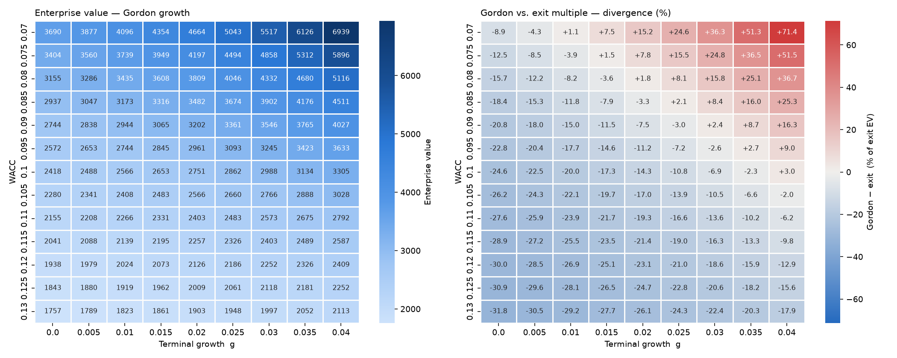

# dcf-valuation-model

A discounted cash flow model that derives free cash flow to the firm (FCFF) from
the three financial statements, projects it ten years forward, and computes
enterprise value under two terminal-value methods, Gordon-growth perpetuity and a
comparable exit multiple. It also builds the free-cash-flow-to-equity (FCFE) view
and reconciles equity value computed directly against equity value backed out
from enterprise value.

The analytical payload is a sensitivity grid showing how enterprise value, and
the disagreement between the two terminal methods, respond across a range of WACC
and terminal-growth assumptions. The core logic lives in an importable, tested
`dcf` package. The notebook is only a walkthrough.

For a full API reference of every function, its inputs, and the available options
(such as the `exit_metric` choices), see [docs/REFERENCE.md](docs/REFERENCE.md).

## What it computes

1. **FCFF** from statement inputs, per period:

   ```
   FCFF = EBIT * (1 - tax_rate) + D&A - Capex - dNWC
   ```

   EBIT is taxed as if the firm were unlevered. The interest tax shield is
   already captured in WACC via the after-tax cost of debt. dNWC is derived from
   the change in revenue, so a zero-growth year ties up no new working capital.

2. **A ten-year projection**, driving every line off revenue: revenue compounds
   at a growth rate (a single rate or a per-year path), and EBIT, D&A, capex, and
   working capital are percentages of revenue.

3. **Enterprise value**, discounting the FCFF stream at WACC and adding the
   discounted terminal value. Terminal value two ways:
   - Gordon growth: `TV_n = FCFF_n * (1+g) / (WACC - g)`, requires `g < WACC`.
   - Exit multiple: `TV_n = metric_n * exit_multiple`, where the metric is EBITDA
     (default), EBIT, or sales. An `implied_exit_multiple` helper reverses the
     Gordon TV into multiple terms as a cross-check against comps.

   Every result reports `tv_share`, the fraction of enterprise value coming from
   the terminal value.

4. **FCFE and a reconciliation check.** FCFE is discounted at the cost of equity
   to give equity value directly, and that value is compared against
   `enterprise value - net debt`. The two agree exactly with no leverage. The gap
   under leverage is a diagnostic, not a bug.

## Installation

```bash
python -m venv .venv
source .venv/bin/activate            # Windows: .venv\Scripts\Activate.ps1
pip install -r requirements.txt
pip install -e .                     # registers `dcf` as an importable package
```

## Usage

Inputs come straight off the statements as dollar figures, with no pre-computing
of ratios:

```python
from dcf.projection import Assumptions, build_projection
from dcf.valuation import enterprise_value

a = Assumptions.from_base_year(
    revenue=1000,   # base-year revenue          (income statement)
    ebit=200,       # operating income           (income statement)
    dna=50,         # depreciation & amortization (cash flow statement)
    capex=70,       # capital expenditure         (cash flow statement)
    nwc=100,        # net working capital LEVEL   (balance sheet)
    tax_rate=0.25,
    growth=0.10,    # a float, or a list of 10 per-year rates
)
df = build_projection(a)

gordon = enterprise_value(df, wacc=0.10, method="gordon", terminal_growth=0.02)
exit_  = enterprise_value(df, wacc=0.10, method="exit",   exit_multiple=8)

print(gordon.enterprise_value, gordon.tv_share)   # ~2751, ~0.56
print(exit_.enterprise_value,  exit_.tv_share)    # ~3209, ~0.62
```

The lower-level `Assumptions(base_revenue, growth, ebit_margin, tax_rate,
dna_pct, capex_pct, nwc_pct)` ratio constructor still exists if you would rather
pass ratios directly.

**Bring your own projection.** If you have already forecast the ten years
yourself, in a spreadsheet or by hand, skip the constant-growth engine and feed
the numbers straight in with `projection_from_lists`. It runs each year through
the same `fcff()` and returns an identical table, so `enterprise_value`, the
grids, and the heatmaps all work unchanged:

```python
from dcf.projection import projection_from_lists

df = projection_from_lists(
    ebit      =[220, 245, 265, 280, 290, 300, 308, 315, 320, 324],
    dna       =[55, 60, 66, 70, 73, 75, 77, 79, 80, 81],
    capex     =[77, 85, 93, 100, 104, 107, 110, 112, 114, 115],
    delta_nwc =[10, 11, 12, 13, 12, 10, 9, 8, 7, 6],
    tax_rate  =0.25,        # scalar, or a per-year list
)
v = enterprise_value(df, wacc=0.10, method="gordon", terminal_growth=0.02)
```

Both terminal methods work because `ebit` and `dna` are present (the exit
multiple reconstructs EBITDA from them). The FCFE reconciliation still uses the
assumptions-based path, since it needs a debt schedule a bare FCFF forecast does
not carry.

**Anchoring WACC.** WACC is an input you sweep, not something the model derives
internally (see Limitations). To pick a defensible center for the sweep, compute
a point estimate from CAPM:

```python
from dcf.valuation import cost_of_equity_capm, wacc

re = cost_of_equity_capm(risk_free=0.04, beta=1.1, equity_risk_premium=0.05)  # 0.095
w  = wacc(equity_value=700, debt_value=300, cost_of_equity=re,
          cost_of_debt=0.06, tax_rate=0.25)                                   # ~0.08
```

**Exit multiple, metric choice and the implied multiple.** The exit method uses
EV/EBITDA by default, but you can value on EV/EBIT or EV/Sales via `exit_metric`
if that is what your comparables trade on. And `implied_exit_multiple` reverses
the Gordon terminal value into multiple terms, telling you what exit multiple
your growth assumption is implicitly equivalent to, so you can sanity-check the
perpetuity against real comps:

```python
from dcf.valuation import implied_exit_multiple

enterprise_value(df, 0.10, "exit", exit_multiple=11, exit_metric="ebit")

implied_exit_multiple(df, wacc=0.10, terminal_growth=0.02)   # ~6.17x EV/EBITDA
```

In the base case the Gordon 2% growth implies a ~6.2x exit, below the 8x comp,
which is exactly why the Gordon enterprise value comes in lower than the exit
method. Feeding the implied multiple back as `exit_multiple` reproduces the
Gordon EV exactly.

**Sensitivity grids and heatmaps:**

```python
import numpy as np
import matplotlib.pyplot as plt
from dcf.sensitivity import ev_grid, divergence_grid
from dcf.plots import plot_ev_grid, plot_divergence_grid

wacc_r = np.round(np.arange(0.07, 0.131, 0.005), 4)
g_r    = np.round(np.arange(0.00, 0.041, 0.005), 4)

fig, (a1, a2) = plt.subplots(1, 2, figsize=(15, 6))
plot_ev_grid(ev_grid(df, wacc_r, g_r), ax=a1)
plot_divergence_grid(divergence_grid(df, wacc_r, g_r, exit_multiple=8), ax=a2)
fig.tight_layout()
fig.savefig("sensitivity.png", dpi=140)
```

**FCFE reconciliation:**

```python
from dcf.fcfe import reconcile_equity

r = reconcile_equity(a, wacc=0.1035, cost_of_equity=0.11, cost_of_debt=0.06,
                     terminal_growth=0.02, debt_pct=0.30, cash=0)
print(r["equity_direct"], r["equity_indirect"], r["gap_pct"])
```

## Project structure

```
dcf/
  fcff.py         # single-period FCFF derivation (pure function)
  projection.py   # Assumptions dataclass, projection engine, bring-your-own path
  valuation.py    # CAPM, WACC, discounting, enterprise-value assembly
  terminal.py     # Gordon-growth and exit-multiple terminal values
  sensitivity.py  # WACC x g grids: enterprise value and method divergence
  plots.py        # heatmap rendering (sequential for EV, diverging for divergence)
  fcfe.py         # FCFE derivation, projection, and equity-value reconciliation
tests/            # pytest suite pinning every derivation and invariant
notebooks/        # walkthrough.ipynb, a narrated tour of the whole model
```

Operating assumptions (`Assumptions`) are kept separate from the market inputs
that get swept (WACC, terminal growth, exit multiple), which are passed as
explicit arguments. That separation is what keeps the sensitivity sweep clean:
the business stays fixed while the market view varies.

## What the sensitivity analysis reveals

Running the base case across WACC (7 to 13 percent) and terminal growth (0 to 4
percent):

- **The two terminal methods disagree by up to about 70 percent** from identical
  operating assumptions, depending purely on where you sit in the WACC/growth
  plane.
- **There is an agreement locus, and it moves.** A diagonal band of near-zero
  divergence marks where the two methods coincide. It slopes from about 0.75
  percent terminal growth at 7 percent WACC to about 3.75 percent at 10 percent
  WACC. Whether your two independent checks corroborate each other is itself an
  assumption.
- **At high discount rates the exit multiple looks optimistic.** Above about 11
  percent WACC, Gordon growth never reaches an 8x exit in a plausible growth
  range.



## Limitations

This is the section that matters. The model is arithmetically correct and tested,
but correctness of arithmetic is not reliability of output. The weaknesses below
are structural, properties of the DCF method itself, not bugs to be fixed.

**Terminal value dominates the valuation.** In the base case, 56 to 62 percent of
enterprise value comes from the terminal value, a single number computed for the
year whose inputs are already least trustworthy, under an assumption that applies
to everything after the forecast horizon. Lower the explicit growth and the
terminal share climbs toward 70 to 80 percent. Most of the answer rests on the
part of the model you can least defend. A DCF is, to a first approximation, a
terminal-value estimate with a decade of decoration in front of it.

**The two terminal methods cannot both be right, and the model does not resolve
which is.** The divergence grid quantifies the disagreement. It does not
adjudicate it. Gordon growth imports a permanent growth assumption. The exit
multiple imports today's market sentiment as a permanent fact about year 10.
Reporting their spread is more honest than picking one, but it measures
uncertainty rather than removing it.

**WACC estimation is circular.** The discount rate depends on the market value of
equity, which is roughly what the DCF is trying to produce. This model sidesteps
it by taking WACC as an exogenous input you sweep (with a CAPM helper to anchor
the center). That is honest about the circularity but does not escape it. It
moves the judgment call outside the model, where it is at least visible.

**Ten-year projections are largely fiction past year three or four.** Constant
growth, constant margins, and fixed percentage-of-revenue ratios are
conveniences, not forecasts. Years 1 to 3 might reflect genuine visibility. Years
4 to 10 are a smooth extrapolation whose main function is to feed the
terminal-value formula.

**The FCFE reconciliation does not close to zero under leverage.** With no debt
it reconciles exactly, a proof the machinery is correct. Under leverage a gap
remains, driven partly by any inconsistency between the WACC you supply and the
model's implied capital structure, and partly by the two methods' different
terminal debt assumptions (FCFE's constant debt ratio means net borrowing
continues in perpetuity). The check exists to surface exactly this kind of
inconsistency, not to be forced to zero.

**Other simplifications.** There is no mid-year discounting convention (cash is
treated as year-end, which slightly understates present value). The tax treatment
is a flat rate with no NOLs or deferred taxes. And every output is a point
estimate. The sensitivity grid substitutes for, but is not, a probabilistic
treatment of the inputs.

The right way to read this model's output is not "the company is worth X" but
"under these stated assumptions the value is X, and here is how hard it leans on
the assumptions I trust least."

## Testing

```bash
pytest -q
```

The suite pins the FCFF hand-calculation and sign conventions, the zero-growth
and compounding invariants, the discount-at-zero identity, the Gordon numerator
and its `g < WACC` guard, the WACC endpoints, the enterprise-value breakdown, the
divergence sign flip, the bring-your-own `projection_from_lists` path, the
configurable exit metric, the round-trip identity between the implied multiple
and the Gordon EV, the equivalence of the two FCFE derivations, and the exact
FCFE reconciliation under no leverage.
